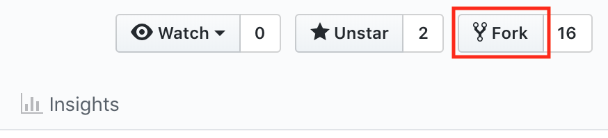

# Shopping Cart App
An interactive shopping cart application using HTML, CSS, and JavaScript.

## Project 
Each item must have:
* A title, img, item description
* 1 button to delete the item from the shopping cart
* 1 button to favorite the item
* 2 buttons (+) (-) to adjust quantity of product
* must list the total price of item



## Prerequisites
If you don't have git on your machine, [install it]( https://help.github.com/articles/set-up-git/).

## Fork this repository

On this page, fork this repo by clicking on the fork button on the top of this page. This will create a copy of this repository in your account.

## Clone the repository


Now clone the forked repo to your machine. Go to your GitHub account, open the forked repo, click on the clone button and then click the *copy to clipboard* icon.

Open a terminal and navigate to the directory you want the shopping-cart app to be saved by typing `cd <directory_name>`. Then press Enter.  

Then run the following git command:

```
git clone "url you just copied"
```
where "url you just copied" (without the quote marks) is the url to this repository (your fork of this project). Hit **Enter** to run the command. 


For example:
```
git clone https://github.com/this-is-you/shopping-cart.git

```
where `this-is-you` is your GitHub username. Here you're copying the contents of the shopping-cart repository in GitHub to your computer.

## Create a branch 
In your local terminal, change to the repository directory:
```
cd shopping-cart
```
Create a branch using the `git checkout` command:
```
git checkout -b <add-new-branch-name>
```
For example:
```
git checkout -b add-new-items
```
> Note: >>The branch name doesn't matter, but ideally you want the name to match the purpose of the branch you just created

## Make changes and commit it 
Open the files you want to change. For example, if you want to add a new item, open `index.html` in your favorite editor. Once you finish editing, save the document. Add those changes to the branch you just created using the `git add` command:

```
git add .
```
> Note: The "." is shortcut for adding all changes. If you just want to add a specific file use `git add <name-of-file>`

Then commit those changes using the git commit command:

```
git commit -m "Added new items"
```
> Note: Insert whatever comments you have inside the quotation marks ""

## Push changes to GitHub
Push your changes using the command git push:

```
git push origin <add-your-branch-name>
```
> Note: replace <add-your-branch-name> with the name of the branch you created earlier

For example:
```
git push origin add-new-items
```

Congratulations! You're done! 
